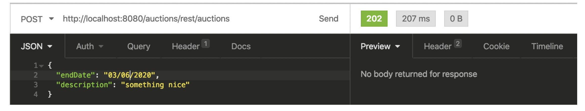
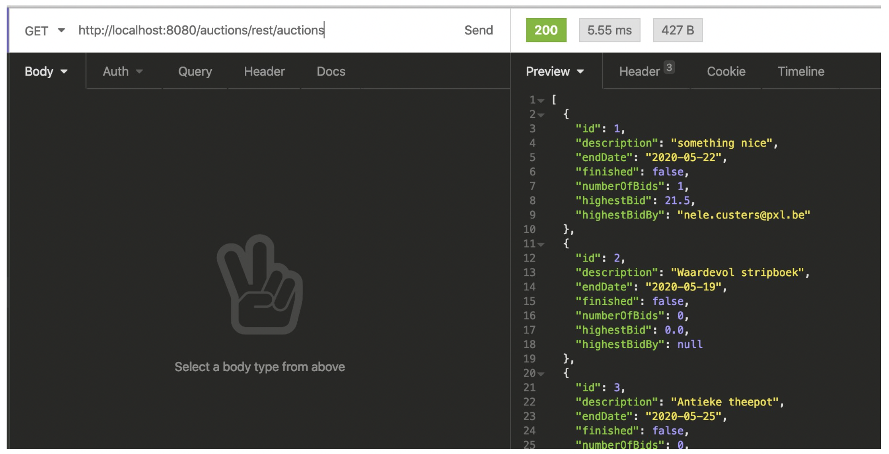
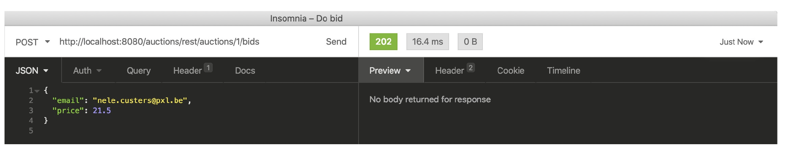
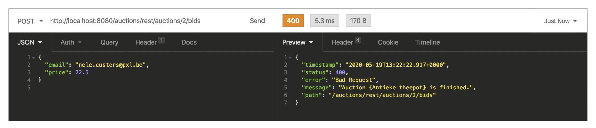
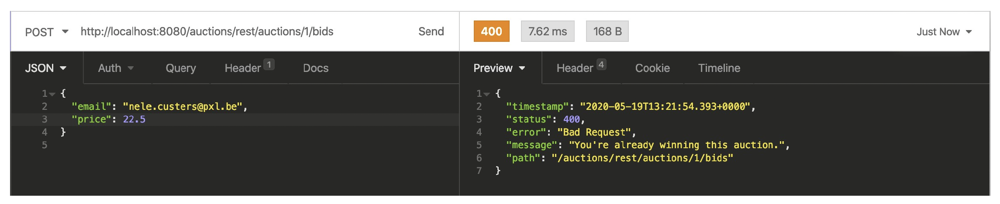
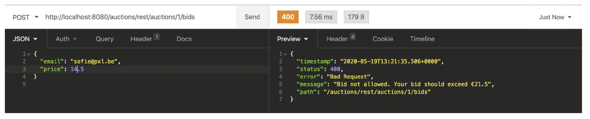

# Auctions Exercise
Hogeschool PXL - Auctions exercise

Practice Spring Boot and unit testing.

Fork this project to get started!

### Introduction

The application uses a MySQL database named auctionsdb.
A file named docker-compose.yml is provided to create the database.
Start this Spring Boot application and explore the provided code.
The User-table is created (or updated) by Hibernate.

The following REST endpoints are available:

1. Create a new user

POST http://localhost:8080/auctions/users
met body:

`{
"firstName": "Sophie",
"lastName": "De Tester",
"email": "sophie@pxl.be",
"dateOfBirth": "24/04/1998"
}`

2. Retrieve all users

GET http://localhost:8080/auctions/users
   

3. Retrieve a user by primary key

GET http://localhost:8080/auctions/users/{userId}

### Task 1: Unit testing

Complete all unit tests. All tests that need implementation are marked with `// TODO implement this test`
For testing an h2 in-memory database can be used.

Pluralsight course on Mockito: https://app.pluralsight.com/library/courses/tdd-junit5/table-of-contents

### Taks 2: Extra entity classes

Items are offered in auctions. Every auction has a description and endDate.
Users can bid. The entity class User is already implemented.
Update the implementation of classes Auction and Bid to make valid entity classes.
There should be a bidirectional relationship between Auction and Bid (cascadetype in the
class Auction is ALL).

In the class Auction you implement the methods isFinished() and findHighestBid().

- isFinished() returns false if the endDate is not expired. If the endDate is today, the Auction isn't expired yet. The method returns true if the endDate of the Auction is expired (after the endDate).
   
- findHighestBid() returns the Bid with the highest value. If there are no bids, an empty Optional is returned.
  
Implement unit tests for both methods.

### Taks 3: AuctionRepository

Create the AuctionRepository. It must be possible to save a new auction, to retrieve an
auction by id, and retrieve all the current auctions.

### Task 4: Create a new auction and retrieve by id

Implement a REST endpoint to create a new auction and retrieve an auction by its id.
When you retrieve an auction by its id, all the bids are retrieved as well.
Besides the bids additional information is retrieved:  numberOfBids, highestBid (value only) and highestBidBy (username).

`

### Task 5: Retrieve all current auctions

Implement a REST endpoint to retrieve all current auctions.
`

### Task 6: Register a bid

Create a REST endpoint to register a bid. All business-logic must be implemented and tested as well. 

POST http://localhost:8080/auctions/rest/auctions/{auctionId}/bids with body
`
{
"email": "sophie@pxl.be",
"price": 22.5
}

`

Following business-rules must be fulfilled.

- The auctionId must belong to be a valid current auction. Bidding on a finished auction is not allowed.
- The email must belong to an existing user.
- The price of the bid must exceed previous bids.
- The bid is not created by the user with the current highest bid.

### Task 7: Create a servlet

Create a Servlet that handles a GET request. The servlet creates an html-page with the
number of active auctions.

